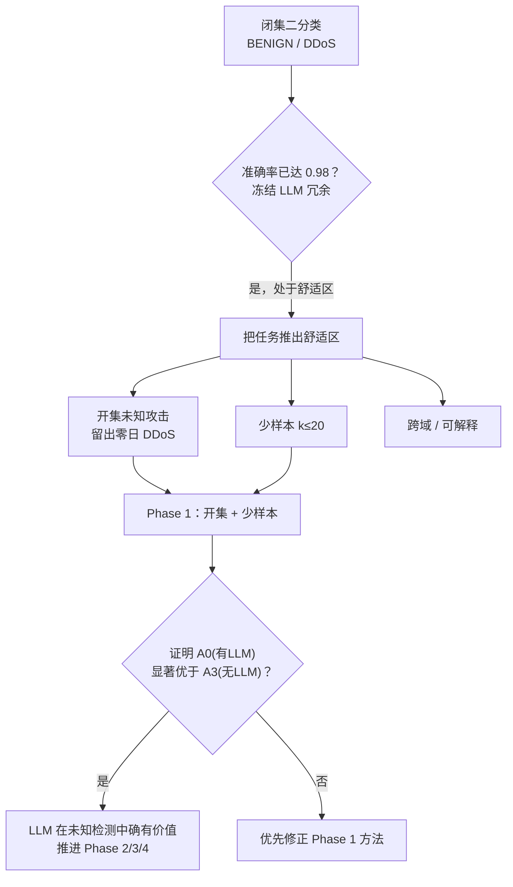
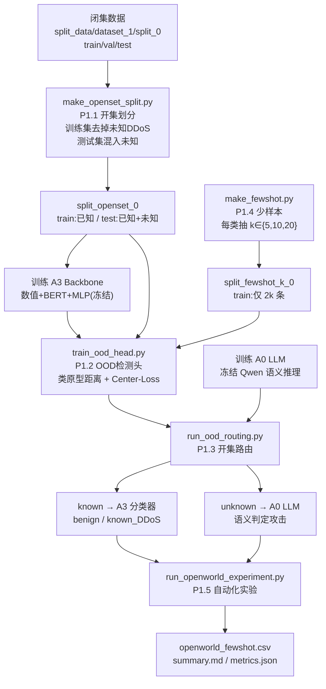
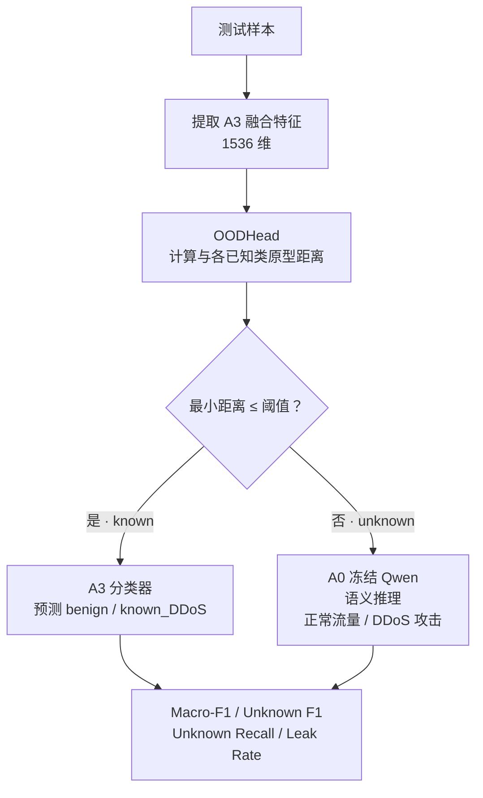
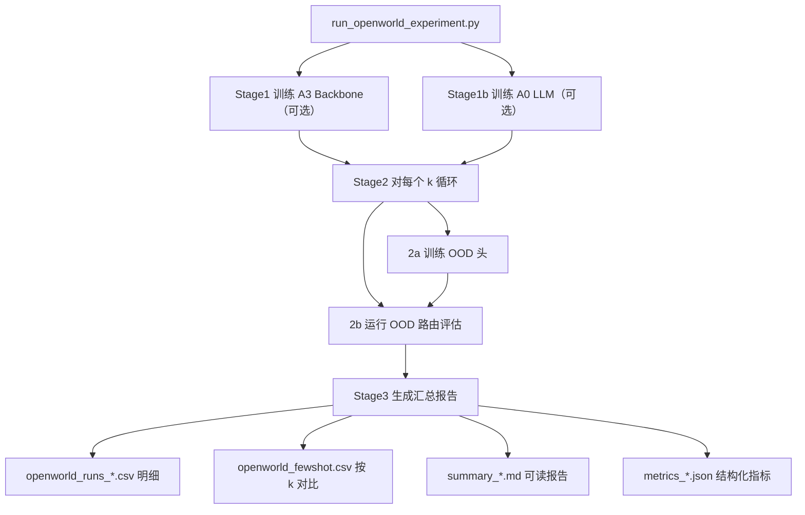

# 多模态融合流量分类 — 项目流程说明（Phase 1）

> 依据：`todos/todo_1.md`（总实施计划）+ `todos/Phase 1实现.md`（Phase 1 落地总结）
> 分支：`exp/openworld-fewshot`

---

## 一、项目一句话定位

用「数值 + 文本(BERT) + 冻结 LLM(Qwen)」三模态融合做网络流量分类（BENIGN / DDoS）。
闭集二分类已到 0.98 的天花板、冻结 LLM 冗余，于是 **Phase 1 把任务推到「开集未知攻击 + 少样本」场景，制造 LLM 的用武之地**，目标是证明 **A0(有LLM) 在开集/少样本下显著优于 A3(无LLM)**。

---

## 二、整体动机与路线

**说明**：当前只做 Phase 1（开集+少样本）。Phase 2（可解释层 + CTI-RAG）、Phase 3（跨域/时间切分）、Phase 4（整合出论文图）是后续线，三条实验线都从 `ablation` 分支切出，共用 `split_data/dataset_1/split_0` 作闭集对照。

---

## 三、Phase 1 主实验流程（数据 → 模型 → 路由 → 少样本 → 报告）

**各阶段要点**：
- **P1.1 开集划分**：从闭集里把一部分 DDoS 标记为「未知」并从训练/验证集移除，只在测试集放回，制造开集。
- **P1.2 OOD 头**：A3 主干冻结，只训「类原型向量」，用欧氏/余弦距离 + 自适应阈值判断未知。
- **P1.3 路由**：已知走 A3 分类器（快），未知走 A0(Qwen) 语义推理（慢但能识别零日）。
- **P1.4 少样本**：每已知类只给 k 条训练样本（k=5/10/20），逼出 LLM 的语义泛化优势。
- **P1.5 报告**：一键串联全流程，输出 CSV / MD / JSON 对比。

---

## 四、开集路由判定流程（最核心的「为什么需要 LLM」）

**说明**：这正是「制造 LLM 用武之地」的机制——A3 在闭集很强但对「没见过的攻击」只会误判成已知类；OOD 头把疑似未知的样本分流给 LLM 做语义推理，从而把 Unknown F1 拉起来。Phase 1 的核心假设就是「开集+少样本下 A0 路由版显著高于 A3-only」。

---

## 五、自动化实验流程（run_openworld_experiment.py）

---

## 六、关键文件对照表

| 阶段 | 核心文件 | 作用 |
|------|----------|------|
| P1.1 | `scripts/make_openset_split.py` | 构造开集划分 |
| P1.2 | `src/model_architectures/ood_head.py` + `scripts/train_ood_head.py` | OOD 检测头（类原型距离） |
| P1.3 | `scripts/run_ood_routing.py` | 已知→A3 / 未知→A0 路由评估 |
| P1.4 | `scripts/make_fewshot.py` | 少样本数据（k=5/10/20） |
| P1.5 | `scripts/run_openworld_experiment.py` + `scripts/report_generator.py` | 自动化实验 + 报告 |
| 复用 | `src/model_architectures/multi_modal_model.py` | 含 `extract_fusion_features()` |
| 复用 | `split_data/dataset_1/split_0` | 规范闭集基准 |

---

## 七、核心评估指标（不再报单一 accuracy）

| 指标 | 含义 |
|------|------|
| Macro-F1 | 三分类（benign/known/unknown）宏平均 F1 |
| **Unknown F1** | 把 unknown 当正类的 F1（**核心指标**） |
| Unknown Recall | 未知 DDoS 被正确检测的比例 |
| Unknown Leak Rate | 未知 DDoS 被误判为 known 的比例 |
| Benign / known DDoS Recall | 各自召回率 |

**一句话结论**：Phase 1 用「开集 + 少样本」把任务难度抬高，让 A3-only 在未知攻击上暴露短板，再用 OOD 路由把未知分流给冻结 Qwen 做语义推理，从而用 A0 vs A3 的差距给出「LLM 有用」的硬证据。
