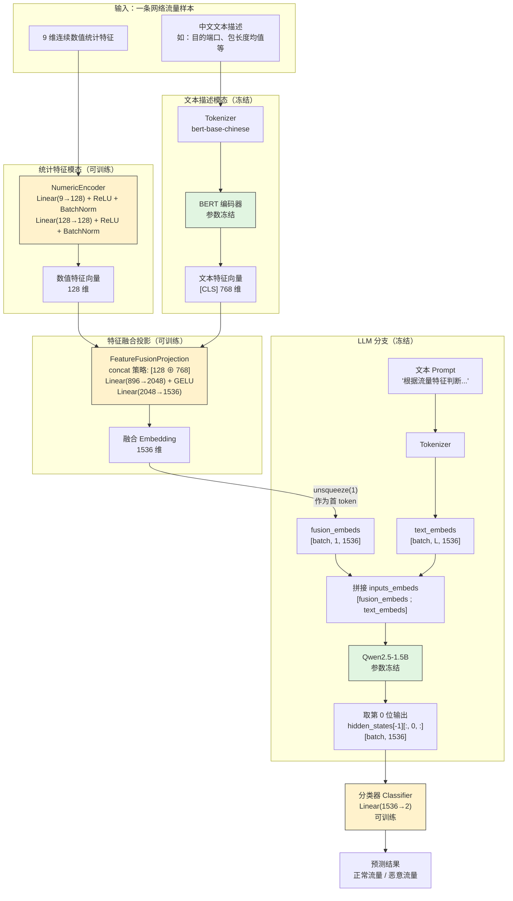

# 多模态融合网络流量分类模型 — 当前架构原理图

> 本图依据 `src/model_architectures/multi_modal_model.py` 的实际代码绘制，反映当前项目的真实前向流程（与 README/docs/theory.md 中描述的“纯 MLP 分类”旧架构不同）。

## 关键说明

1. **可训练参数（黄色）**：`NumericEncoder`、`FeatureFusionProjection`、`Classifier`。
2. **冻结参数（绿色）**：`BERT` 与 `Qwen2.5-1.5B` 均不参与反向传播。
3. **LLM 的实际用法**：融合后的 1536 维向量被插入为输入序列的**第一个 token**，与 Prompt 文本的 token embeddings 拼接后送入冻结 LLM；最终取 LLM 输出序列**第 0 位**的 hidden state 进行分类。
4. **消融变体**：
   - `A0`：完整流程（数值 + 文本 + LLM）
   - `A1`：去掉文本模态（数值 + LLM）
   - `A2`：去掉数值模态（文本 + LLM）
   - `A3`：去掉 LLM（数值 + 文本 + 纯 MLP 分类）
