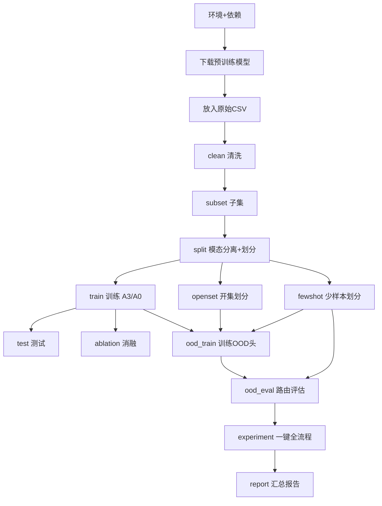

# Implementation Guide（从零执行指南）

> **重要更正**：旧版本文档使用 `python main.py --step ...`，但真实入口 `main.py` **只支持 `--run <配置名>`**（由 `configs/run_configs.py` 的 `RUN_CONFIG` 提供键名）。本文档已按真实接口校正，可直接照抄执行。
> **架构说明**：真实代码 `src/model_architectures/multi_modal_model.py` 中，Qwen2.5-1.5B 作为**冻结的文本编码器**（对真实中文文本做 mean pooling 得到 1536 维向量），融合在 LLM 外部完成，分类由后续分类头负责；并新增 OOD 头与开集/少样本脚本。本文档与 README.md 均已对齐到当前代码（旧「LLM 当分类头 / 4 变体」描述已废弃）。

---

## 0. 整体执行路线（Mermaid）



两条主线：
- **P0 闭集**：`clean → subset → split → train → test / ablation`
- **P1 开集+少样本**：在 `split` 之后做 `openset` + `fewshot`，再 `ood_train → ood_eval / experiment → report`

---

## 1. 环境准备

### 1.1 环境与依赖

- **Python**：3.10+（项目用 cp310/cp313 均可，GPU 训练建议 3.10）
- **GPU**：NVIDIA，显存 ≥ 16GB（训练含 Qwen 的 A0 时需要；A3 纯 MLP 约 4GB 即可）
- **重要**：本项目**不要**混装 conda/pip 的 MKL/PyTorch，否则易触发 `libiomp5` 冲突导致 kernel 崩溃。统一用一个干净 venv。

```bash
# 推荐：用项目自带 managed venv（以 Windows 为例，路径按实际调整）
# 或用 conda 单环境：
conda create -n multimodal-fusion python=3.10 -y
conda activate multimodal-fusion

pip install -r requirements.txt -i https://pypi.tuna.tsinghua.edu.cn/simple
```

### 1.2 下载预训练模型

```bash
python tools/download_bert.py     # bert-base-chinese（~400MB）→ models/
python tools/download_qwen.py     # Qwen2.5-1.5B（~3GB）→ models/（已配 hf-mirror 镜像）
```

> 若只需跑 A3（无 LLM），Qwen 可暂不下载，但显存/速度优势明显，建议先下。

### 1.3 准备原始数据

将 CSV 放进 `data_processing/`，需包含：
- `Label` 列：`BENIGN` / `DDoS`（真实数据来自 CSE-CIC-IDS2018 Friday DDoS + UNSW-NB15）
- 9 个特征列：`Destination Port`、`Bwd Packet Length Mean`、`Avg Bwd Segment Size`、`Bwd Packet Length Max`、`Bwd Packet Length Std`、`URG Flag Count`、`Packet Length Mean`、`Average Packet Size`、`Packet Length Std`

---

## 2. 统一入口怎么用

所有步骤都通过 `main.py` 的 `--run` 驱动。配置名来自 `configs/run_configs.py` 的 `RUN_CONFIG` 键。

```bash
# 列出所有可用配置（含默认参数）
python main.py --list

# 执行某个配置（参数取自 RUN_CONFIG[<键名>].params）
python main.py --run clean
python main.py --run train

# 在配置基础上用命令行覆盖参数
python main.py --run train --dataset_id 3 --split_id 0 --variant A3
```

**合法 `--run` 配置键一览**：

| 键名 | 阶段 | 调用脚本 |
|---|---|---|
| `clean` | P0 预处理 | `scripts/data_cleaning.py` |
| `subset` | P0 预处理 | `scripts/extract_subset.py` |
| `split` | P0 预处理 | `scripts/split_modality.py` |
| `train` | P0 训练 | `scripts/train.py` |
| `test` | P0 训练 | `scripts/test_model.py` |
| `ablation` | P0 训练 | `scripts/run_ablation.py` |
| `openset` | P1 开集 | `scripts/make_openset_split.py` |
| `fewshot` | P1 少样本 | `scripts/make_fewshot.py` |
| `ood_train` | P1 OOD | `scripts/train_ood_head.py` |
| `ood_eval` | P1 OOD | `scripts/run_ood_routing.py` |
| `experiment` | P1 全流程 | `scripts/run_openworld_experiment.py` |
| `report` | P1 汇总 | `scripts/report_generator.py` |

> 规则：带 `_default` 后缀的键（如 `train_default`）是参考基准，**不要**直接 `--run train_default`；实际修改不带后缀的键（`train`/`subset`/...），参数用命令行覆盖最方便。

---

## 3. Part 1：P0 闭集分类（从零到出结果）

> 全程统一 `dataset_id` 与 `split_id`（下面以 `dataset_id=1`、`split_id=0` 为例，首次跑 `subset`/`split` 时 `dataset_id` 会自动分配并打印，请按实际值替换）。

### Step 1 — 数据清洗
```bash
python main.py --run clean
```
- 输入：`data_processing/*.csv`
- 输出：`processed_dataset/processed_dataset.csv` + `label_mapping.json`

### Step 2 — 提取子集（选 9 特征 + 标准化）
```bash
python main.py --run subset --dataset_id 3 --total_samples 5000
```
- 输出：`processed_dataset/dataset_3.csv` + `subset_3_scaled_features.npy` + `subset_3_labels.npy`

### Step 3 — 模态分离与划分（生成 BERT 嵌入）
```bash
python main.py --run split --dataset_id 3
```
- 输出：`split_data/dataset_3/split_0/{train,val,test}.npz`（含 `scaled_features` / `text_embeddings` / `labels`）+ `train_data.csv`

### Step 4 — 训练模型
```bash
# A3：无 LLM，纯 MLP，最快（约 42s），先跑它拿到 backbone
python main.py --run train --dataset_id 3 --split_id 0 --variant A3

# A0*：含冻结 Qwen + LoRA（文本编码器 + 领域适配），需 GPU（最慢）
python main.py --run train --dataset_id 3 --split_id 0 --variant A0*

# 可选：A0（旧用法对照，LLM 全冻结无 LoRA）、A0_frozen（LoRA 对照）、A0*_no_num / A0*_no_text（模态贡献）
```
- 输出：`saved_models/model_<id>/`（只存可训练参数 `pytorch_model.bin` + `config.txt`）
- **记录 `model_id`**：运行后看 `saved_models/` 下的新目录名（如 `model_9`、`model_5`），后续步骤要用。
- **数据集 ID**：当前分支 `split_data/` 含 `dataset_0/2/3/4/5`（多分类），推荐 dataset_3（15 类）为主基准、dataset_0（12 类）为复现；旧分支 dataset_1 已不存在。

### Step 5 — 测试模型
```bash
python main.py --run test --dataset_id 3 --split_id 0 --model_id <A3_id>
```
- 输出：`test_reports/report_<id>.json`（Accuracy / Precision / Recall / F1 + 混淆矩阵）

### Step 6 — 闭集消融实验（六变体）
```bash
# 默认覆盖 A3 / A0* / A0_frozen（见 configs/run_configs.py 的 ablation 键）
python main.py --run ablation --dataset_id 3 --split_id 0
# 完整六变体（含 A0 / A0*_no_num / A0*_no_text）：
python main.py --run ablation --dataset_id 3 --split_id 0 --variants "A3,A0,A0*,A0_frozen,A0*_no_num,A0*_no_text"
```
- 输出：`ablation_results/ablation_results_<时间戳>.csv` + 对比图
- **记录字段已修复**：每份报告现写入 `variant` 与 `llm_use_lora`，可区分 A0\*（开 LoRA）与 A0_frozen（关 LoRA）。
- **结论口径（重要）**：下方旧数字来自**旧分支（master/ablation，CSE-CIC-IDS2018 Friday DDoS → BENIGN/DDoS 二分类，单 seed=42）**，仅说明「文本分支贡献约 99%、冻结 LLM 在闭集上冗余」的定性结论，**不能**直接套到当前多分类六变体实验。当前实验须按「统一 dataset_id + 六变体 + ≥3 seed」重跑，旧 `test_reports/*` 因 `variant`/`llm_use_lora` 缺失不可信，须归档后重做。
  - 旧参考值：A0=0.979 / A1=0.724（去文本崩）/ A2=0.976 / A3=0.980（最快）。

---

## 4. Part 2：P1 开集 + 少样本（验证 LLM 价值的主线，研究中）

> **状态**：Phase 1 主假设（A0\* 融合特征比 A3 更具 OOD 可分性，Unknown F1 / AUROC 更优）**尚未被有效验证**。原「生成式 LLM 路由」方案因结构性缺陷（闭集 argmax 永不输出 unknown）已放弃，改为「共享原型距离 OOD 头对比主干特征质量」。当前 OOD 脚本（`train_ood_head.py` / `run_ood_routing.py`）仍有集成缺陷（未传 `input_ids` 给 LLM 文本分支，导致 A0\*/A0_frozen 文本退化全零），**须先修复（约 0.5–1 天）再执行本 Part**，旧 `openworld_*` 结果不可引用。详见 README 的 Phase 1 章节与 `todos/阶段总结与下一步规划_2026-09-03.md`。

核心设计：所有主干（A3 / A0_frozen / A0\*）共用同一个原型距离 OOD 头，在留出类别的开集划分上对比融合特征的 OOD 可分性。核心指标是 **Unknown F1 / AUROC**。

### Step P1.1 — 构造开集数据（留出类别→unknown）
```bash
python main.py --run openset --dataset_id 3 --source_split_id 0 --unknown_ratio 0.3
```
- 输出：`split_data/dataset_3/split_openset_0/`（train/val 不含未知，test 含 `unknown`）

### Step P1.2 — 构造少样本数据（每已知类 k 条）
```bash
python main.py --run fewshot --dataset_id 3 --source_split_id 0 --k_per_class 5
python main.py --run fewshot --dataset_id 3 --source_split_id 0 --k_per_class 10
python main.py --run fewshot --dataset_id 3 --source_split_id 0 --k_per_class 20
```
- 输出：`split_data/dataset_3/split_fewshot_<k>_0/`

### Step P1.3 — 训练 OOD 检测头（在各主干上各训一个）
```bash
python main.py --run ood_train --model_id <A3_id>        --dataset_id 3 --split_id 0 --variant A3        --fewshot_k 5
python main.py --run ood_train --model_id <A0*_id>       --dataset_id 3 --split_id 0 --variant A0*       --fewshot_k 5
python main.py --run ood_train --model_id <A0_frozen_id> --dataset_id 3 --split_id 0 --variant A0_frozen --fewshot_k 5
```
- 输出：`saved_ood_heads/ood_<id>/`（prototypes + threshold + config）
- **记录 `ood_id`**。

### Step P1.4 — OOD 头特征质量评测
```bash
python main.py --run ood_eval \
    --backbone_model_id <A0*_id> \
    --ood_id <ood_id> \
    --dataset_id 3 --split_id 0 --fewshot_k 5
```
- 输出：`ood_reports/ood_routing_<时间戳>.json`（Unknown F1 / AUROC / Macro-F1 / Recall，按主干对比 A3 / A0_frozen / A0\*）。
- 注：原 `--llm_model_id` 生成式路由参数已废弃（BUG D），评测改为直接比较各主干 OOD 头。

### Step P1.5 — 一键完整实验（待脚本修复）
```bash
python main.py --run experiment \
    --backbone_model_id <A3_id> \
    --llm_model_id <A0*_id> \
    --dataset_id 3 --split_id 0 \
    --k_values "5,10,20,None"
```
- 会自动：对每个 k 训 OOD 头 → 评测 → 生成汇总。

### Step P1.6 — 生成汇总报告
```bash
python main.py --run report
```
- 输出：`test_reports/` + `ood_reports/` 下的 `openworld_fewshot.csv` / `openworld_experiment_summary_<ts>.md` / `openworld_metrics_<ts>.json`。

---

## 5. 常见场景速查

### 场景 A：从零跑通闭集
```bash
python main.py --run clean
python main.py --run subset --dataset_id 3
python main.py --run split  --dataset_id 3
python main.py --run train  --dataset_id 3 --split_id 0 --variant A3
python main.py --run test   --dataset_id 3 --split_id 0 --model_id <A3_id>
```

### 场景 B：完整消融
```bash
python main.py --run clean
python main.py --run subset --dataset_id 3
python main.py --run split  --dataset_id 3
python main.py --run ablation --dataset_id 3 --split_id 0 --variants "A3,A0,A0*,A0_frozen,A0*_no_num,A0*_no_text"
```

### 场景 C：已有模型，只跑开集评估（待 OOD 脚本修复）
```bash
# 假设 model_9=A3, model_5=A0*
python main.py --run openset --dataset_id 3
python main.py --run fewshot --dataset_id 3 --k_per_class 5
python main.py --run ood_train --model_id 9 --dataset_id 3 --split_id 0 --variant A3 --fewshot_k 5
python main.py --run ood_eval --backbone_model_id 5 --ood_id <ood_id> --dataset_id 3 --split_id 0 --fewshot_k 5
python main.py --run report
```

### 场景 D：一键完整开集实验（待 OOD 脚本修复）
```bash
python main.py --run experiment --backbone_model_id 9 --llm_model_id 5 --dataset_id 3 --split_id 0 --k_values "5,10,20,None"
```

---

## 6. 输出目录说明

| 目录 | 内容 | 产生步骤 |
|---|---|---|
| `processed_dataset/` | 清洗后数据 + 子集 npy | Step 1–2 |
| `split_data/` | train/val/test 划分 + BERT 嵌入 | Step 3 |
| `saved_models/` | 训练模型权重 | Step 4 |
| `ablation_results/` | 消融对比结果 | Step 6 |
| `saved_ood_heads/` | OOD 检测头 | P1.3 |
| `test_reports/` | 模型测试报告 | Step 5 |
| `ood_reports/` | OOD 路由评估报告 | P1.4 |
| `logs/` | 各步骤运行日志 | 每步自动 |

---

## 7. 关键坑位（务必注意）

1. **命令接口是 `--run`，不是 `--step`**。旧文档的 `python main.py --step clean` 会直接打印帮助并退出。
2. **生成式路由已废弃**：原 `--llm_model_id` 参数（把 unknown 交 LLM 闭集 argmax 推理）因结构性缺陷已放弃；现 OOD 评测改为直接对比各主干的 OOD 头（A3 / A0_frozen / A0\*），不再需要该参数。
3. **`model_id` 是占位符**：配置里写的 `model_id=9/15` 只是示例，请改用你自己训练后 `saved_models/` 下的真实目录名。
4. **`dataset_id` / `split_id` 要全程一致**：建议固定 `dataset_id=1`、`split_id=0`；首次 `subset`/`split` 没指定时会自动分配，注意看终端打印的值。
5. **文档 ≠ 代码**：README.md / docs/theory.md 为旧架构；变体定义、OOD 头、路由逻辑以 `src/` 真实代码与 `docs/代码结构与数据流.md` 为准。

---

## 8. Troubleshooting

### CUDA 不可用
```bash
python -c "import torch; print(torch.cuda.is_available())"
# 返回 False：检查 CUDA 驱动版本，或改用 CPU 版 PyTorch（A3 可跑 CPU，A0 极慢）
```

### 显存不足（OOM）
- 减小 `--per_device_train_batch_size`（默认 4）或加大 `--gradient_accumulation_steps`
- 先跑 A3（无 LLM）验证流程，A0 再单独调 batch

### libiomp5 / MKL 冲突（kernel 崩溃）
- 原因：conda 的 MKL 与 pip 装的 PyTorch 重复加载 `libiomp5md.dll`。
- 解决：统一用一个 venv；或在崩溃脚本前设 `KMP_DUPLICATE_LIB_OK=TRUE`（临时），长期应清理重复 MKL。

### 查看日志
```bash
cat logs/training/log_*.json  | python -m json.tool
cat logs/ood_routing/log_*.json | python -m json.tool
```
