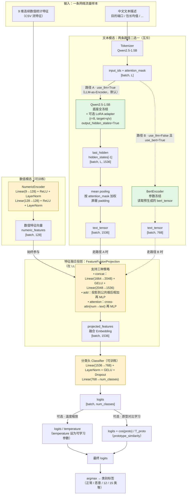

# 多模态融合网络流量分类模型 — 当前架构原理图

> 本图依据 `src/model_architectures/multi_modal_model.py` 的实际代码绘制，反映**当前**前向流程。
> 与旧 README/docs/theory.md 中描述的「融合向量作首 token 喂冻结 LLM 取第 0 位分类」用法**已不同**——
> 真实代码里 LLM 仅作为**文本编码器**在 LLM 外部完成融合，再送入分类头。

## 1. 整体前向流程（架构总览）

## 2. 与旧架构的关键区别

| 维度 | 旧架构（README / 旧 mermaid 描述） | 当前真实架构（multi_modal_model.py） |
|---|---|---|
| 融合位置 | **LLM 内部**：把 1536 维融合向量 unsqueeze 成首 token，与 Prompt token 拼成序列喂入冻结 Qwen，取第 0 位分类 | **LLM 外部**：`FeatureFusionProjection` 先完成两模态融合，再送入纯 MLP 分类头 |
| LLM 角色 | 分类头 | **文本编码器**（mean pooling 取 1536 维向量） |
| 文本输入 | 用固定 Prompt（"根据流量特征判断..."） | 直接喂真实中文流量描述（input_ids + attention_mask） |
| BERT 分支 | 一直启用 → 768 维向量 | 当 `use_llm=True` 时**完全被绕过**（forward Step2 优先走 LLM pooling） |
| LLM 训练性 | 全冻结 | 底座全冻结 + **可选 LoRA adapter**（r=8, q/v） |
| 分类头 | LLM 第 0 位 hidden state → Linear | `Linear→LN→GELU→Dropout→Linear`（MLP），或可选纯 Linear |
| 额外增强 | 无 | 可选温度缩放、原型对比学习、Focal Loss |

## 3. 数据维度速查

| 模块 | 输入维度 | 输出维度 | 说明 |
|---|---|---|---|
| NumericEncoder | 9 | 128 | `use_numeric=False` 时输出全 0 向量占位 |
| Qwen2.5-1.5B（路径 A） | `[batch, L]` (input_ids) | `[batch, 1536]` | mean pooling 末层 hidden states |
| BertEncoder（路径 B） | `[batch, 768]` (bert_tensor) | `[batch, 768]` | 外部传入，向量维度固定 768 |
| FeatureFusionProjection（concat） | `[batch, 128] ⊕ [batch, 1536]` | `[batch, 1536]` | 内部 hidden=2048 |
| Classifier（mlp） | `[batch, 1536]` | `[batch, num_classes]` | num_classes 实际由训练数据决定（2 / 12 / 15） |

## 4. 消融变体（来自 `scripts/train.py` 的 VARIANT_CONFIGS）

| 变体 | use_numeric | use_bert | use_llm | LoRA | 用途 |
|---|---|---|---|---|---|
| A3 | ✓ | ✓ | ✗ | — | 基线：纯数值+BERT+MLP，**验证冻结 LLM 是否冗余** |
| A0（旧用法） | ✓ | ✓ | ✓ | ✗ | 旧"首 token 喂 LLM"用法的当代等效实现 |
| A0*（新用法） | ✓ | ✗ | ✓ | ✓ | LLM-as-Encoder + LoRA，**新正确用法** |
| A0_frozen | ✓ | ✗ | ✓ | ✗ | 对照 A0*：**验证 LoRA 领域适配的价值** |
| A0*_no_num | ✗ | ✗ | ✓ | ✓ | 纯文本+LLM+LoRA，验证**数值模态贡献** |
| A0*_no_text | ✓ | ✗ | ✗ | — | 纯数值+MLP，验证**文本模态贡献** |

可回答的 4 个问题：
1. **LLM 作文本编码器行不行？** → A0* vs A3
2. **旧用法错在 placement，不是 LLM 没用？** → A0* vs A0
3. **LoRA 领域适配是否有用？** → A0* vs A0_frozen
4. **各模态贡献？** → A0*_no_num / A0*_no_text / A0*

## 5. 关键代码位置

- 模型主类：`src/model_architectures/multi_modal_model.py::MultiModalFusionModel`
- forward 中关键三步：
  - Step 1：`numeric_encoder(stat_tensor)` → `[batch, 128]`
  - Step 2：若 `use_llm=True`，`outputs.hidden_states[-1]` + mean pooling → `[batch, 1536]`
  - Step 3：`fusion_projection(numeric_features, text_tensor)` → `[batch, 1536]`
  - Step 4：`classifier(fusion_output)` → logits
- 融合模块：`src/model_architectures/fusion_projection.py::FeatureFusionProjection`
- 数值编码器：`src/model_architectures/numeric_encoder.py::NumericEncoder`
- 变体配置：`scripts/train.py::VARIANT_CONFIGS`