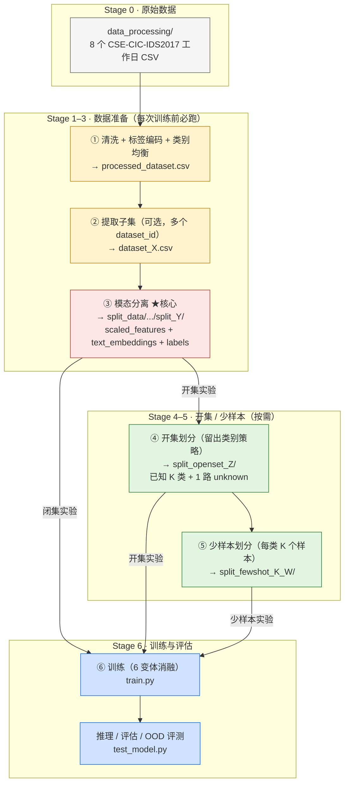
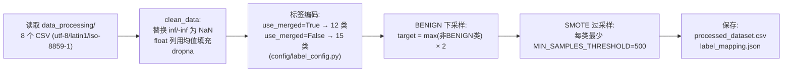
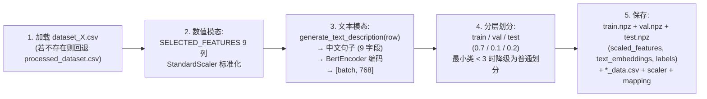
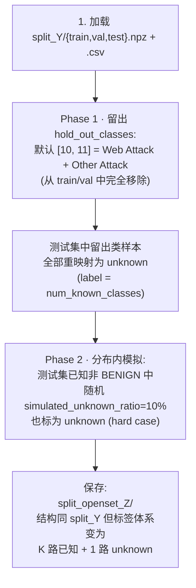
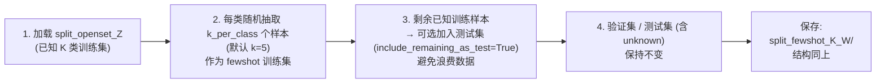

# 多模态融合网络流量分类模型 — 数据集处理流程图

> 本图依据 `scripts/` 下 6 个数据脚本的实际代码绘制，反映**当前**真实数据处理流程。
> 旧手绘图「raw → cleaned → subset → 分离模态 → 划分 train/test」虽然方向对，但**省略了开集 / 少样本**阶段，且**没有标出关键文件位置和维度变化**——本图补全这两块。

## 1. 整体主干流程（6 阶段）



> **读法**：自上而下三条链路——左 `①→②→③` 是必经的数据准备链；中 `④→⑤` 是开集 / 少样本的实验数据准备链（可跳过）；右 `⑥→推理评估` 是训练链。准备链末端 `③` 既可直连训练（闭集），也可先经 `④/⑤` 再训练（开集 / 少样本）。具体命令参数见第 7 节速查表。

## 2. Stage 1 · `data_cleaning.py` 内部细节



**关键参数（`scripts/data_cleaning.py`）**

| 参数 | 默认值 | 作用 |
|---|---|---|
| `BENIGN_RATIO` | 2.0 | BENIGN 保留量 = 最大非 BENIGN 类样本数 × 2 |
| `MIN_SAMPLES_PER_CLASS` | 500 | 触发 SMOTE 过采样的最小样本数阈值 |
| `USE_SMOTE` | True | 是否启用 SMOTE（imblearn） |
| `RANDOM_STATE` | 42 | 全局随机种子 |

**输出**

- `processed_dataset/processed_dataset.csv`：~20w 行，包含 9 个 `SELECTED_FEATURES` + 全部原始列 + `Label`
- `processed_dataset/label_mapping.json`：`label_to_id` / `id_to_label` / `num_classes` / 各类别样本数

## 3. Stage 3 · `split_modality.py` 内部细节 ★ 核心



**`SELECTED_FEATURES`（9 列，从 `extract_subset.py` / `split_modality.py` 顶部提取）**

| 字段名 | 角色 |
|---|---|
| Bwd Packet Length Mean | 反向包平均长度 |
| Avg Bwd Segment Size | 反向段平均大小 |
| Bwd Packet Length Max | 反向包最大长度 |
| Bwd Packet Length Std | 反向包长度标准差 |
| Destination Port | 目的端口 |
| URG Flag Count | URG 标志位计数 |
| Packet Length Mean | 包平均长度 |
| Average Packet Size | 平均包大小 |
| Packet Length Std | 包长度标准差 |

**`generate_text_description(row)` 把这 9 个数值字段"翻译"成中文句子**（如 "目标端口是80。反向包平均长度 256.3 字节。…包长度标准差 12.4。"）→ 送给冻结的 `bert-base-chinese` 取 embedding → 768 维向量。

> ⚠️ 这正是 2026-09-09 消融得出的关键发现：**文本模态本质上是数值模态的另一种写法**，信息几乎完全重叠。

**输出目录结构**

```
split_data/dataset_0/split_0/
├── train.npz          # scaled_features [N,9] + text_embeddings [N,768] + labels [N]
├── val.npz
├── test.npz
├── train_data.csv     # 含 text_description 备份，供 LLM 分支后续按需使用
├── val_data.csv
├── test_data.csv
├── train_scaler.npy   # {'mean', 'std'}，用于推理时标准化
└── label_mapping.json
```

## 4. Stage 4 · `make_openset_split.py` 留出类别策略



**与旧策略的本质区别**

| 维度 | 旧策略 ❌ | 新策略（当前代码）✅ |
|---|---|---|
| unknown 来源 | 从已知类中随机抽 10% 标为 unknown | hold_out_classes 指定的类别**完全不出现在 train/val** |
| 分布偏移 | **无**（只是改了标签，特征未变） | **有**（留出类的特征分布对模型完全未知） |
| OOD 头效果 | 几乎随机（因为样本与已知类同分布） | 可学习到真正的 OOD 边界 |

**`DEFAULT_HOLD_OUT = [10, 11]` 选类理由**（代码注释）

1. 这两个本身就是合并类，适合做 unknown
2. 留出后已知类仍有 10 个，覆盖 DoS / DDoS / 端口扫描 / 暴力破解 / 僵尸网络等多种攻击
3. 留出类在特征分布上与已知类有真实差异

## 5. Stage 5 · `make_fewshot.py` 少样本采样



## 6. 数据形态在各阶段的转换

| 阶段 | 形态 | 关键字段 | 类别数 |
|---|---|---|---|
| **Stage 0** 原始 CSV | 一行 = 一条流量记录 | 全部 CICIDS 字段 + Label（字符串） | 15 类原始 |
| **Stage 1** 清洗后 CSV | 同上 | 同上 + Label（int） | 12 类合并 / 15 类原始 |
| **Stage 2** dataset_X.csv | 子集样本 | 同上 | 同上 |
| **Stage 3** split_*.npz | 三组 npz：scaled_features + text_embeddings + labels | `[N, 9]` + `[N, 768]` + `[N]` | 同上 |
| **Stage 4** split_openset_* | 同上，但 train/val 不含 hold_out 类 | 同上 | K=10 已知 + 1 unknown |
| **Stage 5** split_fewshot_K_* | 同上，train 每类仅 K 个 | 同上 | K=10 已知 + 1 unknown |

## 7. 关键脚本与输入/输出路径速查

| 脚本 | 输入 | 输出 | 何时必须 |
|---|---|---|---|
| `data_cleaning.py` | `data_processing/*.csv` | `processed_dataset/processed_dataset.csv` | 第一次运行时 |
| `extract_subset.py` | `processed_dataset/processed_dataset.csv` | `processed_dataset/dataset_X.csv` 等 | 需要多个不同大小的子集时 |
| `split_modality.py` | `processed_dataset/dataset_X.csv` | `split_data/dataset_X/split_Y/` | **任何训练前必跑** |
| `make_openset_split.py` | `split_data/dataset_X/split_Y/` | `split_data/dataset_X/split_openset_Z/` | 仅开集实验 |
| `make_fewshot.py` | `split_data/dataset_X/split_openset_Z/` | `split_data/dataset_X/split_fewshot_K_W/` | 仅少样本实验 |
| `train.py` | `split_data/dataset_X/split_*/` | `saved_models/...`、`test_reports/...` | 训练时 |

## 8. 开集 / 少样本的语义澄清

- **开集 ≠ 异常检测**：测试集中**真的有**留出类别的样本（被标记为 `unknown`），不是模拟异常。
- **少样本 ≠ 类别少**：少样本是**已知 K 类下每类只有 K 个训练样本**，类别数不变（仍是 K+1 路）。
- **少样本实验必须建立在开集划分上**：`make_fewshot.py` 第一个参数就是 `--source_split_id`，且要求源目录是 `split_openset_*`。
- **闭集实验直接用 `split_*`**：6 变体消融（A3 / A0 / A0* / A0_frozen / A0*_no_num / A0*_no_text）跑的是闭集。